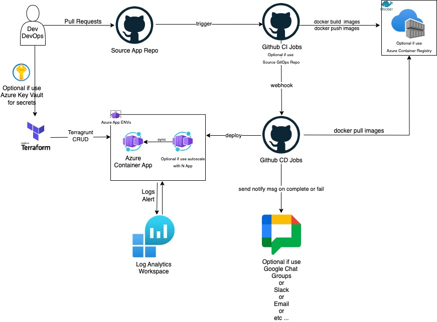

# DevOpsChallenge – Azure Container App


### [View all Roadmaps](https://github.com/nholuongut/all-roadmaps) &nbsp;&middot;&nbsp; [Best Practices](https://github.com/nholuongut/all-roadmaps/blob/main/public/best-practices/) &nbsp;&middot;&nbsp; [Questions](https://www.linkedin.com/in/nholuong/)
<br/>

[](https://git.io/typing-svg)

# **About Me🇻**
- ✍️ Blogger
- ⚽ Football Player
- ♾️ DevOps Engineer
- ⭐ Open-source Contributor
- 😄 Pronouns: Mr. Nho Luong
- 📚 Lifelong Learner | Always exploring something new
- 📫 How to reach me: luongutnho@hotmail.com
- 
---

## 🔥 Overview

This project demonstrates:
- Minimal Flask-based microservice
- Dockerized using non-root user
- Deployed to Azure Container Apps using Terraform
- Automated using GitHub Actions CI/CD



---

## 🧱 Prerequisites

- [Docker](https://docs.docker.com/get-docker/)
- [Azure CLI](https://learn.microsoft.com/en-us/cli/azure/)
- [Terraform](https://developer.hashicorp.com/terraform/downloads)

Configure:
```bash
az login
```

# Notes
- Make sure you set GitHub secrets:
- Docker: `DOCKER_USERNAME, DOCKER_PASSWORD`
- Azure: `ARM_CLIENT_ID, ARM_CLIENT_SECRET, ARM_SUBSCRIPTION_ID, ARM_TENANT_ID`

# Build Docker Images for App
### Go to app folder vs Build
```
git clone git@bitbucket.org:devopschallenge devops-challenge-senior.git
cd ../app
docker build -t nholuongut/devopschallenge:latest .
docker run -p 8080:8080 luongutnho2023/devopschallenge:latest
curl http://localhost:8080/
```
## Output 
`{"ip":"172.17.0.1","timestamp":"2025-04-14T09:30:45.337879"}`

### Docker push to registry
- ```docker push nholuongut/devopschallenge:latest```

# Remote Terraform State Setup
## First-time backend setup:
```
az group create --name rg-devopschallenge --location eastus

az storage account create \
  --name devopschallengestorage \
  --resource-group rg-devopschallenge \
  --location eastus \
  --sku Standard_LRS

az storage container create \
  --name tfstate \
  --account-name devopschallengestorage
```
## Init infrastructue with Terraform
```
cd terraform
terraform init
terraform apply -auto-approve -var-file="terraform.tfvars"
```


#### Get your app URL:
`
echo "https://$(terraform output -raw container_app_url)"
`

# GitHub CI/CD
#### On push to main, this runs:
- Docker build + push
- Terraform deploy

# Output
```
{
  "timestamp": "2025-04-15T10:00:00.000Z",
  "ip": "203.0.113.42"
}
```


# I'm are always open to your feedback🚀
# **[Contact Me🇻]**
* [Name: Nho Luong]
* [Telegram](+84983630781)
* [WhatsApp](+84983630781)
* [PayPal.Me](https://www.paypal.com/paypalme/nholuongut)
* [Linkedin](https://www.linkedin.com/in/nholuong/)


[](https://ko-fi.com/nholuong)

# License🇻
* Nho Luong (c). All Rights Reserved.🌟
